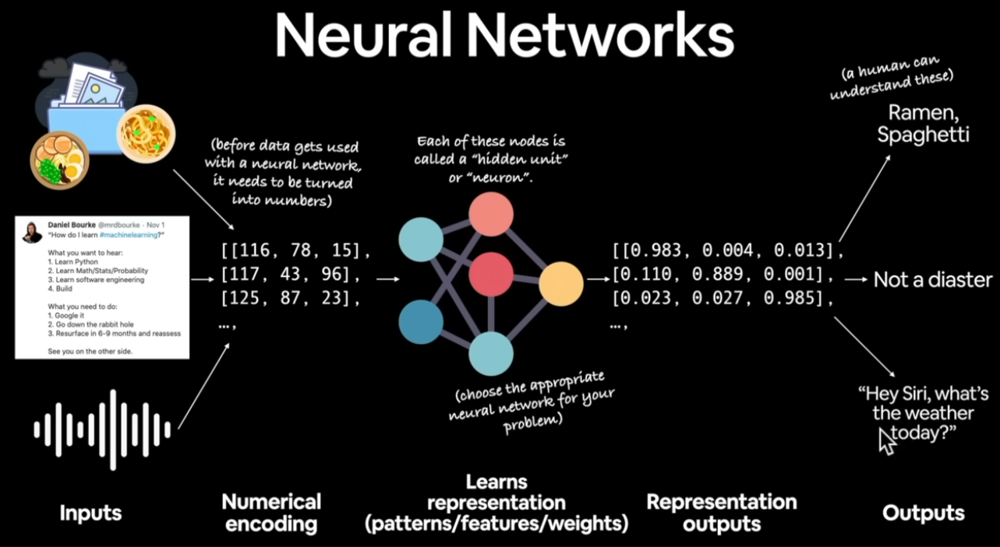

## Introduction
In Machine Learning, you only use what you need:
- Suitable for ML:
    - a system with **many manully set rules**.
    - Continually **changing environment**
- Not suitable:
    - Needs to be **explainability** => ML has trained **patterns that is hard to understand**
    - **Rule-based system** is **cost effective** enough
    - The ML system has **unexceptable amount of errors**
    - **Small data**

## 23:02, Anatomy of a Neural Network

## 32:05, Learning Paradigm
- Supervised Learning: *sample + lable => patterns*
- Unsupervised (self-supervised) learning: *samples => patterns > labeled later*
- Transfer learning (fine tuning): use the **patterns** learned **by other model**.

- *Reinforcemeant learning: kind of like Supervised Learning in realtime :v

## 43:18, into PyTorch !